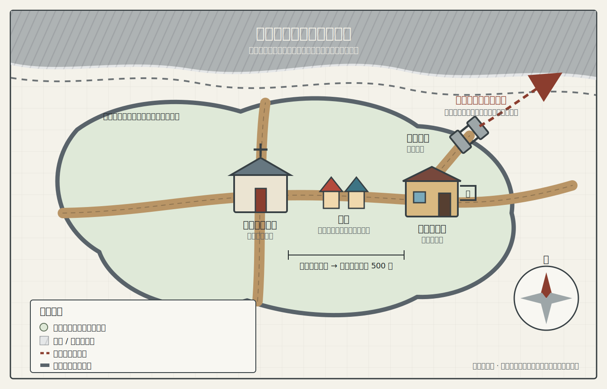
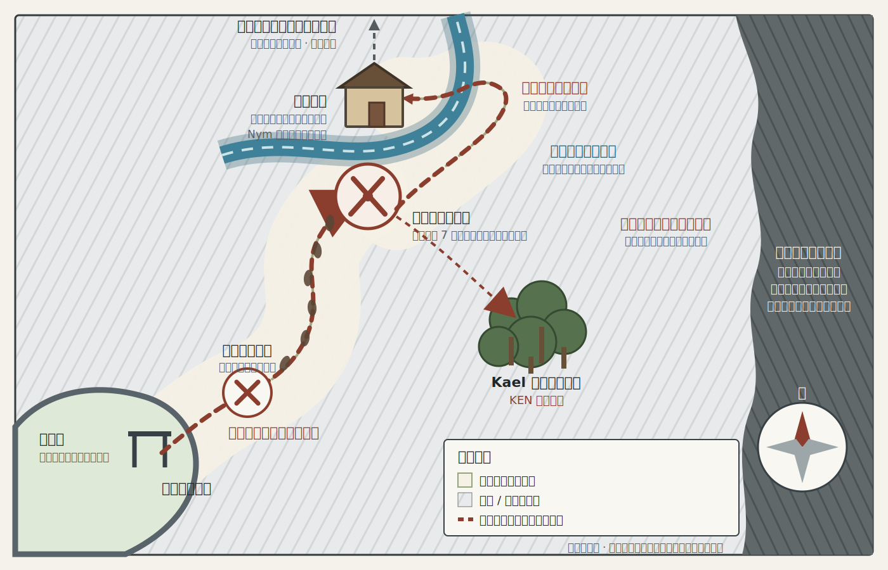

# KEN 小队探索地图

这些地图只记录角色当前知道的地理信息，不是 DM 全知地图。位置和路线按游戏中的口述信息绘制；未经测量的距离、边界和地形均为示意。

## 小镇探索地图

已确认的信息：

- 小镇约数公里方圆。
- 厄拉西斯神殿位于小镇中心，是此前所称的中心教堂。
- 第一晚的旅馆在厄拉西斯神殿以东约 500 米。
- 从旅馆前往厄拉西斯神殿会经过集市。
- 小镇有城墙，东北出口是正式城门。
- 第 1 天晚上侦测到的疑似导师相关魔法痕迹指向小镇东北方向。
- 城市北方最近刚发生过一次与黑潮有关的战斗。
- 北方的近期黑潮战场与东北方向的导师线索不是同一地点。

## 东北城门外追踪地图

已确认的信息：

- 小队根据东北方向的疑似导师相关线索从正式东北城门出发，先向东北走了一小段。
- 小队随后发现战斗痕迹和可追踪的脚印。
- 脚印转向北方；小队沿脚印向北曲折前进约数公里。
- 路线最终抵达发生僵尸战斗的河流附近。
- 小队在河边击败 6 只僵尸，随后在 Kael 找到的小树林中短休。
- 尚未证实脚印、导师线索与北方黑潮战场三者之间存在关联。

## 图面约定

- 清晰标注的地点：已经到访或由可靠信息确认。
- 虚线和“约”字：方向或距离已知，但没有精确测绘。
- 斜线阴影：尚未探明，不能据此判断道路、建筑、敌人或地形。
- 近期黑潮战场：位于城市北方，与东北方向的导师线索分开；目前只知道大致方位，边界和遗留危险仍未知。

## 后续可确认

- 小镇和第一晚旅馆的名称。
- 城墙的精确形状、其他城门的位置及守卫部署。
- 战斗痕迹距离小镇多远，以及向北追踪路线的精确曲折与距离。
- 河流名称、流向、小队抵达的河岸，以及小树林位于哪一侧。
- 北部黑潮战区与河流、当前路线之间的相对位置。
